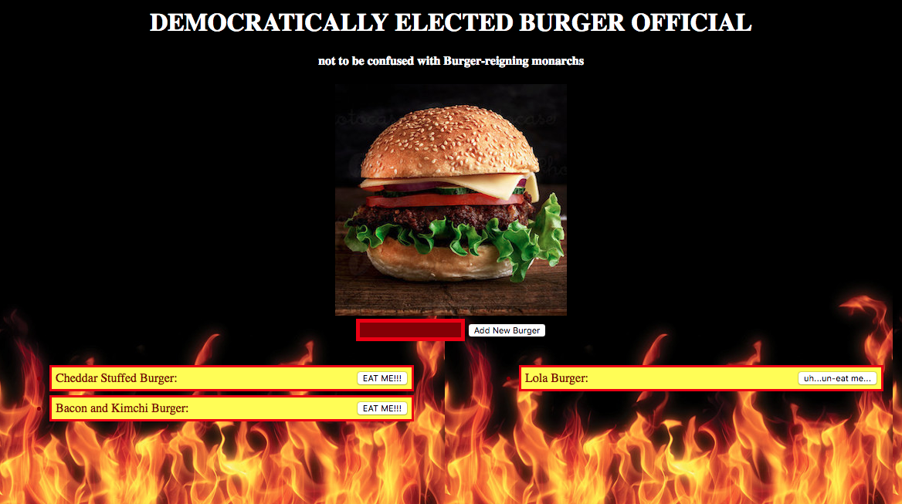

# Democratically Elected Burger Official!

Burgers, one of the most popular foods on the planet. Or at the very least, one of OUR favorites! Why else would you be here?

Have you ever gone to a restaurant and found yourself disappointed by the limited options for burgers? Have you found yourself in despair over the fact that you could never have The Perfect Burger you've always dreamed of?

Then welcome to the most free burger joint in the world! If you can imagine the burger, then you can add it to menu and eat it!

If you enjoyed the burger, you can even use our cutting edge MySQL technology to go back in time and *un*eat the burger, leaving it as perfectly pristine as when you first imagined it! With the ability to constantly loop through time you can create infinite burgers and enjoy them infinitely [on our Heroku deployment](https://obscure-ravine-64478.herokuapp.com/)!

Of course, you can always git-clone this respository and maintain a local instance, just in case you find yourself craving a burger at the end of all space and time, where internet charges are exorbitant. Just remember to set up your connection.js file accordingly!